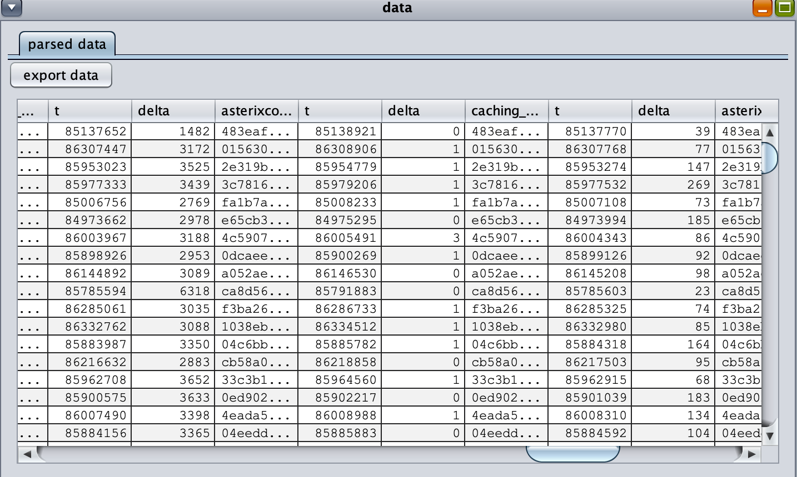
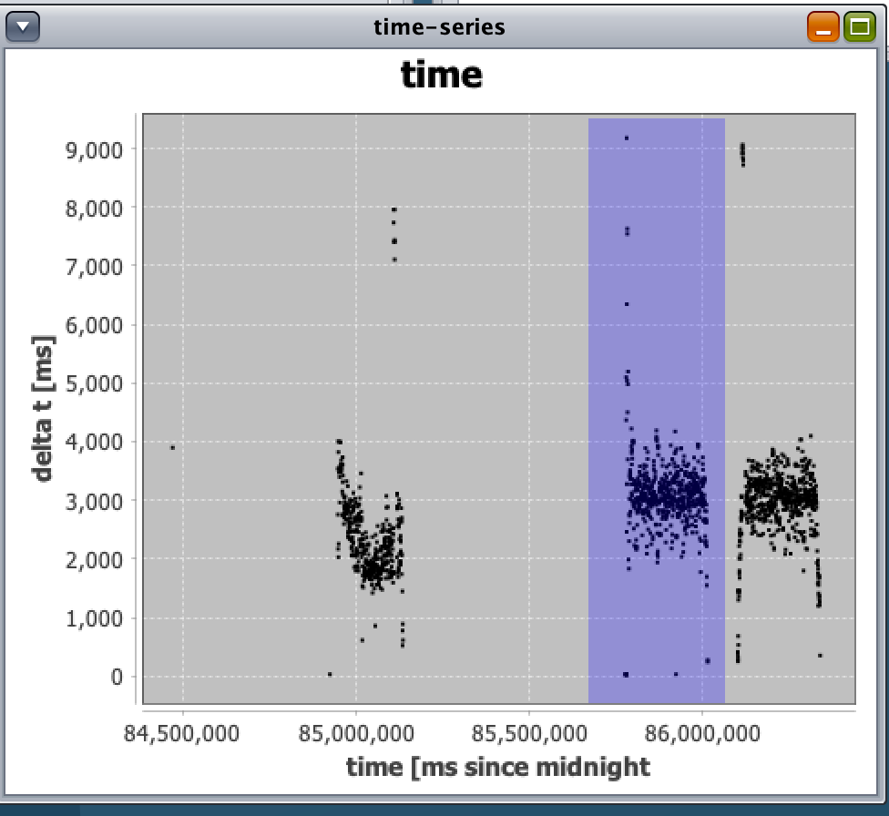
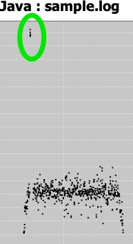
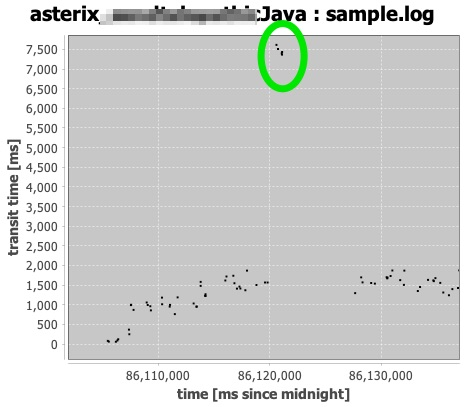
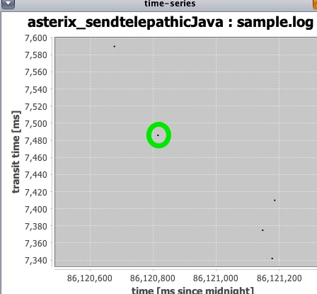
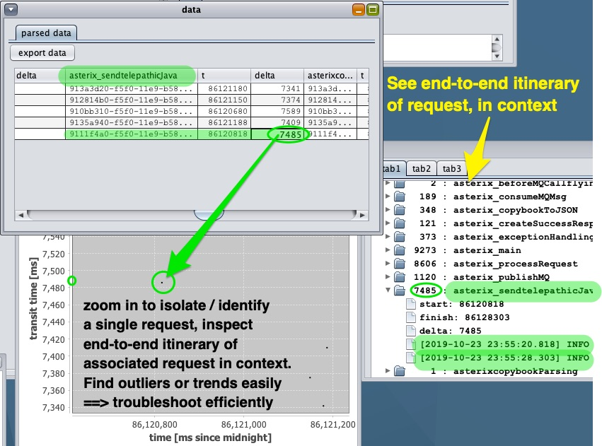
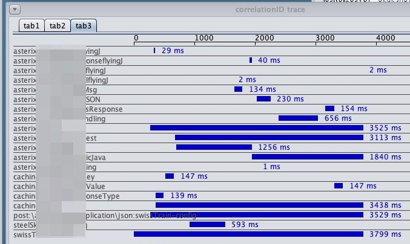

# nextGenPerfAnalyzer

1. select an existing config-file
1. select a directory that has logs you want to analyze
1. once a config is selected, this selectable list will be populated in the same order as the file
1. if you don't have a config, click this *once a logfile is selected* (see later in this list). A configuration file will be created; if no events are found the config will be empty
1. select a logfile here. Selecting a log triggers parsing (watch the log window to see progress). A logfile with 280K lines can parse in about 6 seconds; performance will vary based on density of relevant log-lines, number of relevant log-lines etc..
1. if a config-file is loaded, click this tab to see it (the apparent strangeness of the config will be documented later)

# analysis

Select a "milestone marker" in the list (see "3"). Assuming a log file that has relevant data has been parsed, the click will trigger rending of 2 graphs - a time-series, and a histogram of transit-times for all found events. There are many tutorials and explanations of the intent and value of histograms out there, so we won't cover them here.

(maybe put a link to a concise, credible video?)

When a great many data-points are present  it can be hard to tell from a time-series just how many are in different ranges - that's where the histogram comes in.

The patterns that the 2 graphs show will tell you a lot about the behavior. Clicking through the different milestone types **particularly if you sort the milestones in logical order considering the execution flow** will help visualize where the slow spots are.

The data-grid

 

is sortable (click headers) to make it easier to locate problem areas, maxima etc..

A more intuitive way to spot problems is to look for long transit times oni the scatter plot. Zoom in by dragging (take care to retain all the vertical piece of the plot so you can always see how much data to expect in the grid. See below:

Once zoomed, the data listed in the grid is filtered to include only those transit-events whose start-time is withing the clock-time range you zoomed to. If you zoom close enough (take care to retain all the data-points in the plot withing your zoom-time) the data can be filtered until just a few points show - making it easy to spot the bad players in the grid. Click on the correlationID entry for one of the bad players - that will find all the transit-events with that correlationID and list them in the tree-view (see "selected event" tab on the log-window). This will make it obvious whether there is some system effect that is affecting all the parts of the request (correlationID) you clicked.

Being able to zoom in, isolate individual requests and see the end-to-end itinerary for that request, in context, is essential to understanding whether it's an outlier or if something systemic is going on. The itinerary shows details of each section of the code. Once a request is identified, the timing chart shows time-bars per section on the chart, clarifying where paralellism exists

Remember that parallelism, asynchronicity etc. will affect the data, what can be found/linked etc.. **Everything** is about the correlationID (regardless of what language, technology, etc. is used).

As long as logs are in the appropriate form (and there's latitude to customize - up to a point), this tool can trace and expose things that would never be seen just paging through logs, or looking at lumped statistics.
